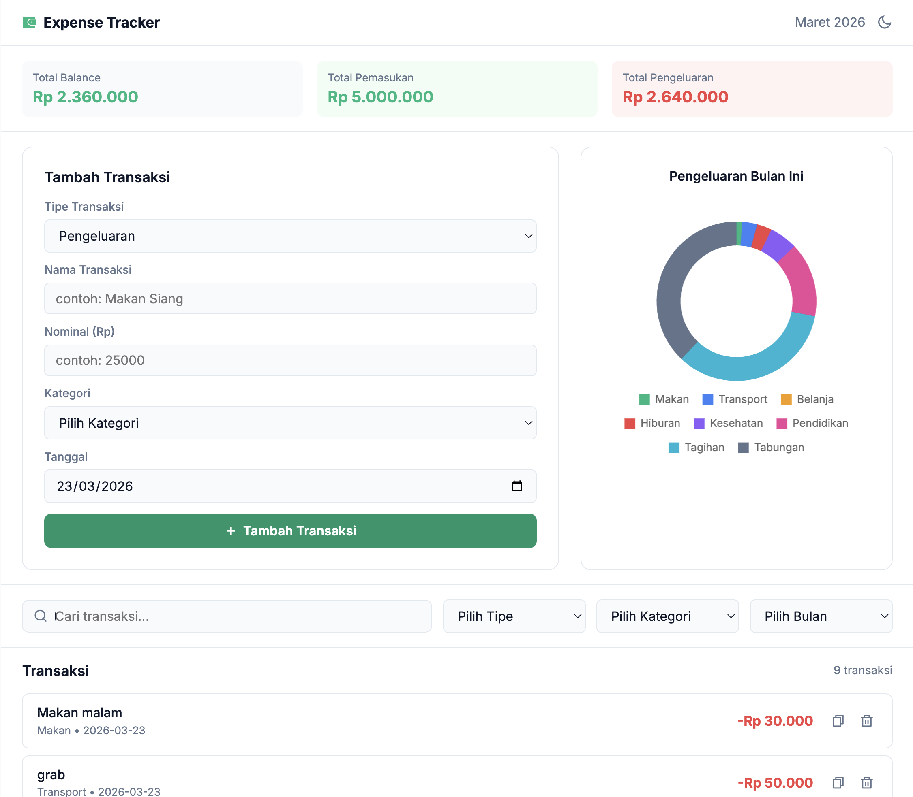

# Expense Tracker

> A modern, single-page personal finance tracker — know exactly where your money goes, every month.



## 📌 About The Project

Expense Tracker is a personal finance management app built with pure HTML, CSS, and Vanilla JavaScript. It helps users track their daily income and expenses by category, set budget limits, and visualize spending patterns through an interactive chart — all without any backend or login required.

## 🎯 Learning Objectives

Through this project, the following concepts are explored and applied:

**CSS**

- CSS Variables for theme system (dark/light mode)
- Flexbox & responsive layout

**JavaScript**

- DOM manipulation (add, delete, render elements)
- Array methods (`filter`, `reduce`, `find`, `map`)
- Event listeners & form handling
- localStorage for data persistence
- Chart.js for data visualization

## ✨ Features

- Add & delete transactions with name, amount, category, type, and date
- Summary bar showing total balance, income, and expenses
- Donut chart visualization of spending by category
- Filter transactions by category and month
- Search transactions by name
- Budget limit per category with warning indicator
- Dark / Light mode toggle (preference saved to localStorage)
- All data persists in localStorage — no data lost on refresh

## 🛠️ Built With

- HTML5 (Semantic Markup)
- CSS3 (Pure — no frameworks)
- JavaScript (Vanilla — no frameworks)
- [Chart.js](https://www.chartjs.org/) — for data visualization

## 🚀 Getting Started

1. Clone this repository
   ```bash
   git clone https://github.com/riwandi-tech/expense-tracker.git
   ```
2. Open `index.html` in your browser — no build tools or installations required.

## 🗺️ Roadmap

- [ ] Phase 1 — Project Setup & HTML Structure
- [ ] Phase 2 — CSS Styling & Theme System
- [ ] Phase 3 — Core JavaScript (Add & Display)
- [ ] Phase 4 — Delete & localStorage
- [ ] Phase 5 — Filter, Search & Sort
- [ ] Phase 6 — Chart.js Integration
- [ ] Phase 7 — Budget Limit Feature
- [ ] Phase 8 — Dark/Light Mode Toggle
- [ ] Phase 9 — Polish & Final Touches

## 👤 Author

**Riwandi**
[GitHub](https://github.com/riwandi-tech)
